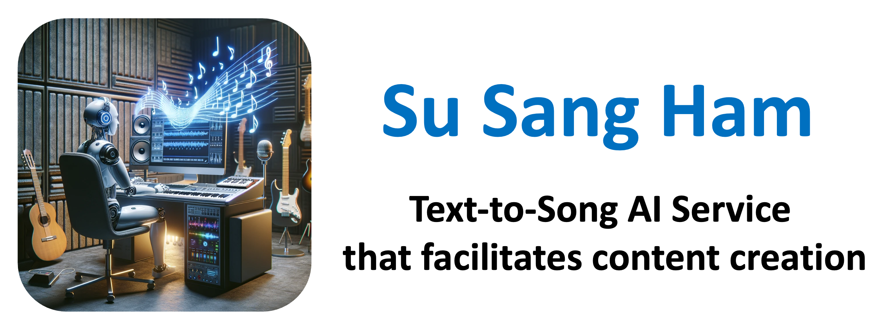

# <p align="center"></p>
This code deals with the implementation of AI technology that converts simple text input into a song. In other words, it aims to provide a service that facilitates content creation by generating songs tailored to one's specific situation. To achieve this, this repository specifically includes the following three technologies.

* 📝 **Prompt to lyrics convert module**
* 🎤 **Lyrics to singing voice generation**
* 🎹 **Melody generation using text condition about genre and situation**

### 📌 You can check our demo results at the website below.
https://youtu.be/ARVWiaF10y0?si=O-Aa5_GBjwAahYws

# Installation
```
python -m pip install 'torch>=2.0'
python -m pip install -U audiocraft
python -m pip install -U git+https://git@github.com/facebookresearch/audiocraft#egg=audiocraft
pip install -r requirments.txt
```
# 📝 Prompt to lyrics convert module
<p align="center"></p>

Please insert your OpenAI API key information into the config file. Then, run `prompt_to_lyrics.py` with argument that include the content you want to turn into a song. Note that including specific details and genre style in the lyrics you want to incorporate can yield better results.

# 🎤 Lyrics to singing voice generation
The previous step involved generating lyrics, and now we proceed with vocal synthesis. Run `voice_synthesis.py` with argument that include the path of lyrics text file. Users will soon be able to adjust the duration and pitch themselves, a feature that is planned to be added and released shortly.

Our code is based on the VITS code (https://github.com/jaywalnut310/vits).

# 🎹 Melody generation
You can input the desired genre and scenarios as conditions to compose the melody of the song you want to create. For example, you can set conditions like "EDM music for a village event" or "lofi music which is calm and pleasant to listen". Run `melody_generation.py` with argument that include the text about genre and situation.

Our code is based on the audiocraft code (https://github.com/facebookresearch/audiocraft).
